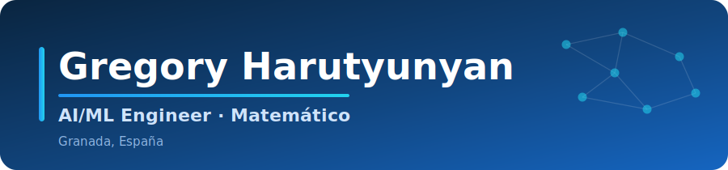
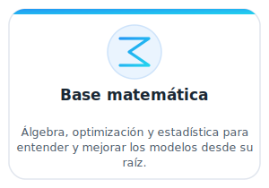
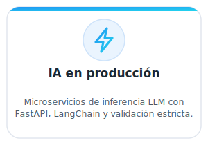
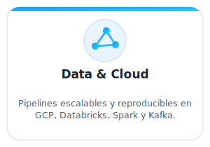
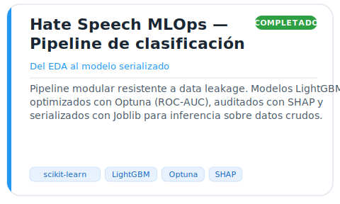
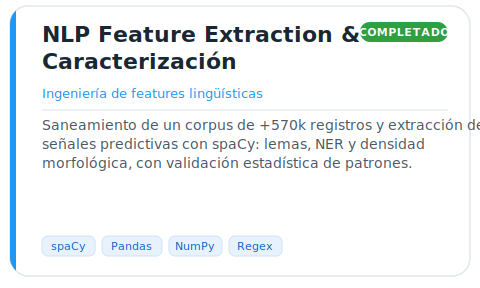
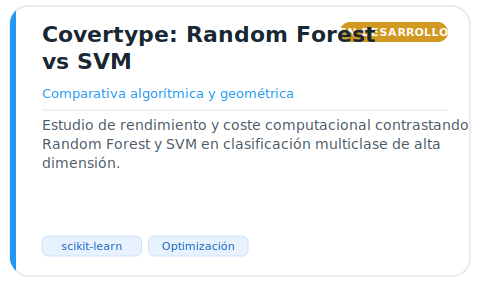
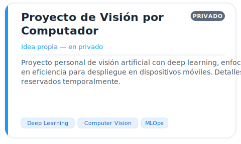
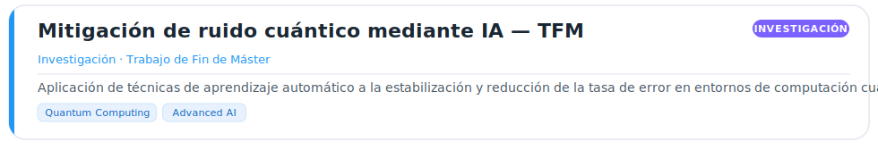
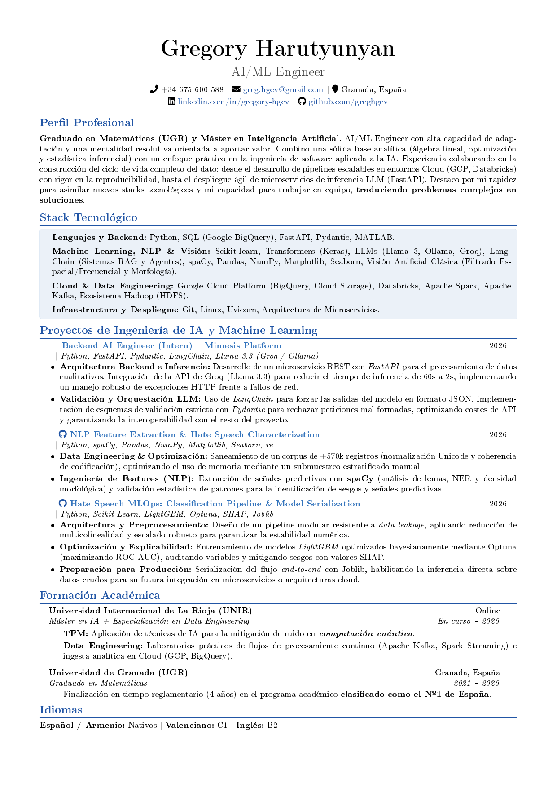

  

 

 

  

 

<picture>
  <source media="(prefers-color-scheme: dark)" srcset="assets/headers/sobre-mi-dark.svg">
  
</picture>

**AI/ML Engineer** con base de **Matemático** (UGR) y **Máster en IA + especialización en Data Engineering** (en curso). Combino una sólida base analítica (álgebra lineal, optimización y estadística inferencial) con ingeniería de software aplicada a la IA: desde pipelines de datos escalables y reproducibles en cloud hasta el despliegue de microservicios de inferencia con LLMs.

Me muevo con soltura en todo el ciclo de vida del dato y asimilo nuevos stacks con rapidez, traduciendo problemas complejos en soluciones que llegan a producción.

 

<table>
  <tr>
    <td width="33%" align="center"></td>
    <td width="33%" align="center"></td>
    <td width="33%" align="center"></td>
  </tr>
</table>

---

<picture>
  <source media="(prefers-color-scheme: dark)" srcset="assets/headers/experiencia-dark.svg">
  
</picture>

### Backend AI Engineer — Prácticas · Mimesis Platform
> 
<b>2026</b> &nbsp; <code>Python</code> · <code>FastAPI</code> · <code>Pydantic</code> · <code>LangChain</code> · <code>Llama 3.3 (Groq / Ollama)</code>

>
> - **Arquitectura backend e inferencia.** Microservicio REST con FastAPI para el procesamiento de datos cualitativos. Integración de la API de Groq (Llama 3.3) reduciendo el tiempo de inferencia de **60 s a 2 s**, con manejo robusto de excepciones HTTP frente a fallos de red.
> - **Validación y orquestación de LLM.** LangChain para forzar las salidas del modelo en formato JSON y validación estricta con Pydantic, rechazando peticiones mal formadas, optimizando costes de API y garantizando la interoperabilidad con el resto del sistema.

 

---

<picture>
  <source media="(prefers-color-scheme: dark)" srcset="assets/headers/stack-dark.svg">
  
</picture>

**Lenguajes &amp; Backend**

**Machine Learning · NLP · Visión**

**LLMs &amp; GenAI**

**Cloud &amp; Data Engineering**

**Infraestructura &amp; Herramientas**

 

---

<picture>
  <source media="(prefers-color-scheme: dark)" srcset="assets/headers/proyectos-dark.svg">
  
</picture>

<table>
  <tr>
    <td width="50%" align="center"></td>
    <td width="50%" align="center"></td>
  </tr>
  <tr>
    <td width="50%" align="center"></td>
    <td width="50%" align="center"></td>
  </tr>
  <tr>
    <td colspan="2" align="center"></td>
  </tr>
</table>

 

---

<picture>
  <source media="(prefers-color-scheme: dark)" srcset="assets/headers/formacion-dark.svg">
  
</picture>

### Máster en Inteligencia Artificial + especialización en Data Engineering — UNIR
> 
<b>En curso · 2025</b>

> 
> - **TFM:** aplicación de técnicas de IA para la mitigación de ruido en computación cuántica.
> - **Data Engineering:** laboratorios de flujos de procesamiento continuo (Apache Kafka, Spark Streaming) e ingesta analítica en cloud (GCP, BigQuery).

### Graduado en Matemáticas — Universidad de Granada (UGR)
> 
<b>2021 – 2025</b>

> 
> - Finalizado en tiempo reglamentario (4 años) en el grado de Matemáticas clasificado como **nº 1 de España**.

 

**Asignaturas del máster** · despliega cada una para ver el trabajo y las actividades

<!-- ===========================================================
  CÓMO EDITAR LAS ACTIVIDADES:
  Dentro del <ul> de cada asignatura, añade o quita líneas en HTML
  (va dentro de una celda de tabla, por eso NO es markdown):
        <li><a href="https://github.com/greghgev/NOMBRE-DEL-REPO">Nombre de la actividad</a></li>
============================================================ -->

<table>
  <tr>
    <td valign="top">
      

        
<b>Procesamiento del Lenguaje Natural</b>

        <ul>
          <li><a href="https://github.com/greghgev/nombre-del-repo">Actividad de ejemplo — edita texto y enlace</a></li>
        </ul>
      

    </td>
    <td valign="top"></td>
    <td valign="top">Representación de texto, modelos de lenguaje y clasificación.</td>
  </tr>
  <tr>
    <td valign="top">
      

        
<b>Técnicas de Aprendizaje Automático</b>

        <ul>
          <li><a href="https://github.com/greghgev/nombre-del-repo">Actividad de ejemplo — edita texto y enlace</a></li>
        </ul>
      

    </td>
    <td valign="top"></td>
    <td valign="top">Modelos supervisados, validación, regularización y evaluación.</td>
  </tr>
  <tr>
    <td valign="top">
      

        
<b>Visión Artificial</b>

        <ul>
          <li><a href="https://github.com/greghgev/nombre-del-repo">Actividad de ejemplo — edita texto y enlace</a></li>
        </ul>
      

    </td>
    <td valign="top"></td>
    <td valign="top">Filtrado espacial/frecuencial, morfología y redes convolucionales.</td>
  </tr>
  <tr>
    <td valign="top">
      

        
<b>Razonamiento y Planificación Automática</b>

        <ul>
          <li><a href="https://github.com/greghgev/nombre-del-repo">Actividad de ejemplo — edita texto y enlace</a></li>
        </ul>
      

    </td>
    <td valign="top"></td>
    <td valign="top">PDDL y algoritmos de búsqueda (informada y no informada).</td>
  </tr>
  <tr>
    <td valign="top">
      

        
<b>Aprendizaje Automático No Supervisado</b>

        <ul>
          <li><a href="https://github.com/greghgev/nombre-del-repo">Actividad de ejemplo — edita texto y enlace</a></li>
        </ul>
      

    </td>
    <td valign="top"></td>
    <td valign="top">Clustering, reducción de dimensionalidad y detección de anomalías.</td>
  </tr>
  <tr>
    <td valign="top">
      

        
<b>Redes Neuronales</b>

        <ul>
          <li><a href="https://github.com/greghgev/nombre-del-repo">Actividad de ejemplo — edita texto y enlace</a></li>
        </ul>
      

    </td>
    <td valign="top"></td>
    <td valign="top">Arquitecturas profundas, optimización y entrenamiento de modelos.</td>
  </tr>
</table>

 

---

**Idiomas**

 

<!-- ===========================================================
  SECCIÓN "ACTIVIDAD EN GITHUB" — OCULTA.
  (Si la reactivas, necesitarás de nuevo los workflows de la carpeta .github
  que se eliminaron, porque generan metrics.svg y la rama output.)
  Para mostrarla, borra ESTA línea de apertura del comentario y la de cierre.
============================================================

<picture>
  <source media="(prefers-color-scheme: dark)" srcset="assets/headers/actividad-dark.svg">
  
</picture>

  

<picture>
  <source media="(prefers-color-scheme: dark)" srcset="https://raw.githubusercontent.com/greghgev/greghgev/output/snake-dark.svg">
  
</picture>

 

============================ FIN SECCIÓN OCULTA ============================ -->

---

<picture>
  <source media="(prefers-color-scheme: dark)" srcset="assets/headers/cv-dark.svg">
  
</picture>

 

Haz clic en la imagen para abrir el PDF completo.

 

---

### Disponible para incorporación

Abierto a posiciones de **AI/ML Engineer** (Junior) y prácticas en equipos de Machine Learning, LLMs y Data Engineering.

