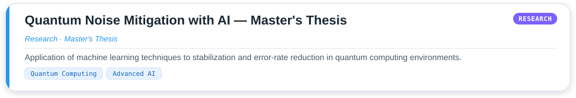

  

 

 

  

 

<picture>
  <source media="(prefers-color-scheme: dark)" srcset="assets/headers/sobre-mi-dark.svg">
  
</picture>

**AI/ML Engineer** con base de **Matemático** (UGR — grado nº 1 de España) y **Máster en IA + especialización en Data Engineering** en curso en UNIR. 

He trabajado de forma práctica en las principales ramas de la IA: procesamiento del lenguaje natural (embeddings, transformers, RAG/KAG), visión artificial (morfología matemática, segmentación por color), redes neuronales, aprendizaje no supervisado y LLMs en producción. La especialización en Data Engineering añade el lado cloud a escala: pipelines de streaming con **Spark + Kafka** sobre **Dataproc**, análisis analítico con **BigQuery** y despliegue en **GCP**.

Parte del máster ha sido trabajo en equipo con entregables reales, y asimilo nuevos stacks con rapidez. Me muevo con comodidad en todo el ciclo del dato: desde la exploración y el preprocesamiento hasta el despliegue de servicios de inferencia.

 

---

<picture>
  <source media="(prefers-color-scheme: dark)" srcset="assets/headers/experiencia-dark.svg">
  
</picture>

### Backend AI Engineer / LLMOps — Prácticas · Qualígrafo S.L.
> mar. – may. 2026 · 2 meses

> <code>Python</code> · <code>FastAPI</code> · <code>LangChain</code> · <code>Pydantic</code> · <code>Groq API</code> · <code>Azure OpenAI</code> · <code>Ollama</code> · <code>HPC (SCAYLE)</code>
>
> Motor analítico *backend* para la plataforma Mimesis (investigación cualitativa → instrumentos cuantitativos mediante IA).
>
> - **Arquitectura asíncrona para HPC.** Backend síncrono rediseñado a sistema de colas por *jobs*: respuesta inmediata con ID + *polling*. Despliegue en clúster SCAYLE sin bloqueos ni *timeouts*.
> - **Mitigación de alucinaciones.** JSON Schemas estrictos + validación Pydantic en tiempo real. Respuestas malformadas bloqueadas antes de propagarse al sistema.
> - **Flexibilidad de inferencia**. Abstracción LangChain sobre Ollama / Groq / Azure OpenAI intercambiable vía .env para optimizar latencia y coste según el entorno.

 

---

<picture>
  <source media="(prefers-color-scheme: dark)" srcset="assets/headers/stack-dark.svg">
  
</picture>

**Lenguajes &amp; Backend**

**Machine Learning · NLP · Visión**

**LLMs &amp; GenAI**

**Cloud &amp; Data Engineering**

**Infraestructura &amp; Herramientas**

 

---

<picture>
  <source media="(prefers-color-scheme: dark)" srcset="assets/headers/proyectos-dark.svg">
  
</picture>

 

---

<picture>
  <source media="(prefers-color-scheme: dark)" srcset="assets/headers/formacion-dark.svg">
  
</picture>

### Máster en Inteligencia Artificial + especialización en Data Engineering — UNIR &nbsp; 
> 
<b>En curso · nov. 2025 – jul. 2026</b>

> 
> - **TFM:** aplicación de técnicas de IA para la mitigación de ruido en computación cuántica.
> - **Data Engineering:** laboratorios de flujos de procesamiento continuo (Apache Kafka, Spark Streaming) e ingesta analítica en cloud (GCP, BigQuery).

### Graduado en Matemáticas — Universidad de Granada (UGR)
> 
<b>2021 – 2025</b>

> 
> - Finalizado en tiempo reglamentario (4 años) en el grado de Matemáticas clasificado como **nº 1 de España**.

 

<b>Asignaturas del máster</b> · <u>despliega</u> cada una para ver el trabajo y las actividades

<!-- ===========================================================
  CÓMO EDITAR LAS ACTIVIDADES:
  Dentro del <ul> de cada asignatura, añade o quita líneas en HTML
  (va dentro de una celda de tabla, por eso NO es markdown):
        <li><a href="https://github.com/greghgev/NOMBRE-DEL-REPO">Nombre de la actividad</a></li>
============================================================ -->

<table>
  <tr>
    <td valign="top", width="35%">
      

        
<b>Procesamiento del Lenguaje Natural</b>

        <ul>
          <li><a href="https://github.com/greghgev/master-ia-unir/tree/main/pln/newsgroups-embeddings-vs-transformers">Word Embeddings vs Transformers — Clasificación de texto (20 Newsgroups)</a></li>
          <li><a href="https://github.com/greghgev/master-ia-unir/tree/main/pln/pln_rag_kag_comparison">RAG vs KAG — Asistente de normativa universitaria con grafo de conocimiento</a></li>
        </ul>
      

    </td>
    <td valign="top"></td>
    <td valign="top">spaCy, Hugging Face, Freeling; morfosintaxis, fine-tuning de LLMs y chatbots.</td>
  </tr>
  <tr>
    <td valign="top">
      

        
<b>Técnicas de Aprendizaje Automático</b>

        <ul>
          <li><a href="https://github.com/greghgev/master-ia-unir/tree/main/tecnicas-aa/airquality-linear-regression-vs-decision-tree">Linear Regression vs Decision Tree — Predicción de benceno (AirQualityUCI)</a></li>
          <li><a href="https://github.com/greghgev/master-ia-unir/tree/main/tecnicas-aa/covertype-rf-svm-comparison">SVM vs Random Forest — Clasificación multiclase de cubierta forestal (Covertype)</a></li>
        </ul>
      

    </td>
    <td valign="top"></td>
    <td valign="top">Naive Bayes, árboles de decisión, métricas (F1, recall, ROC) y optimización de hiperparámetros.</td>
  </tr>
  <tr>
    <td valign="top">
      

        
<b>Visión Artificial</b>

        <ul>
          <li><a href="https://github.com/greghgev/master-ia-unir/tree/main/vision-artificial/retinoblastoma-spatial-vs-morphology">Filtros espaciales vs morfología matemática — Detección de retinoblastoma</a></li>
          <li><a href="https://github.com/greghgev/master-ia-unir/tree/main/vision-artificial/amazon-deforestation-segmentation">Segmentación HSV en imágenes Landsat — Deforestación Amazonas (2000–2019)</a></li>
        </ul>
      

    </td>
    <td valign="top"></td>
    <td valign="top">Procesamiento temporal/frecuencial, extracción de características, texturas y multiescala.</td>
  </tr>
  <tr>
    <td valign="top">
      <b>Razonamiento y Planificación Automática</b>
    </td>
    <td valign="top"></td>
    <td valign="top">PDDL y algoritmos de búsqueda (informada y no informada).</td>
  </tr>
  <tr>
    <td valign="top">
      

        
<b>Aprendizaje Automático No Supervisado</b>

        <ul>
          <li><i>Próximamente</i></li>
        </ul>
      

    </td>
    <td valign="top"></td>
    <td valign="top">K-Means, DBSCAN, t-SNE, MDS, ISOMAP, detección de anomalías y aprendizaje por refuerzo.</td>
  </tr>
  <tr>
    <td valign="top">
      

        
<b>Redes Neuronales</b>

        <ul>
          <li><i>Próximamente</i></li>
        </ul>
      

    </td>
    <td valign="top"></td>
    <td valign="top">Keras, TensorFlow, GANs, CUDA/cuDNN; imágenes, series temporales y cloud AI.</td>
  </tr>
</table>

 

<b>Asignaturas del Programa Superior en Ingeniería de Datos</b> · <u>despliega</u> cada una para ver el trabajo y las actividades

<!-- ===========================================================
  CÓMO EDITAR LAS ACTIVIDADES:
  Dentro del <ul> de cada asignatura, añade o quita líneas en HTML
  (va dentro de una celda de tabla, por eso NO es markdown):
        <li><a href="https://github.com/greghgev/NOMBRE-DEL-REPO">Nombre de la actividad</a></li>
============================================================ -->

<table>
  <tr>
    <td valign="top", width="40%">
      

        
<b>Ingeniería para el Procesado Masivo de Datos</b>

        <ul>
          <li><a href="https://github.com/greghgev/master-ia-unir/tree/main/ingenieria-datos/walmart-sales-bigquery-eda">Walmart Sales EDA — Análisis exploratorio con Google BigQuery y SQL</a></li>
          <li><a href="https://github.com/greghgev/master-ia-unir/tree/main/ingenieria-datos/flights-spark-streaming-kafka">Flights — Spark Structured Streaming + Kafka sobre Google Dataproc</a></li>
        </ul>
      

    </td>
    <td valign="top"></td>
    <td valign="top">ETL masivas con Spark, almacenes relacionales sobre Hive y servicios cloud (GCP, Azure, AWS).</td>
  </tr>
  <tr>
    <td valign="top">
      

        
<b>MLOps y AIOps: Despliegue de Modelos en Entornos de Producción</b>

        <ul>
          <li><i>Próximamente</i></li>
        </ul>
      

    </td>
    <td valign="top"></td>
    <td valign="top">CI/CD para ML con MLflow, Docker, Google Vertex AI y orquestación en producción.</td>
  </tr>
</table>

 

---

**Idiomas**

 

<!-- ===========================================================
  SECCIÓN "ACTIVIDAD EN GITHUB" — OCULTA.
  (Si la reactivas, necesitarás de nuevo los workflows de la carpeta .github
  que se eliminaron, porque generan metrics.svg y la rama output.)
  Para mostrarla, borra ESTA línea de apertura del comentario y la de cierre.
============================================================

<picture>
  <source media="(prefers-color-scheme: dark)" srcset="assets/headers/actividad-dark.svg">
  
</picture>

  

<picture>
  <source media="(prefers-color-scheme: dark)" srcset="https://raw.githubusercontent.com/greghgev/greghgev/output/snake-dark.svg">
  
</picture>

 

============================ FIN SECCIÓN OCULTA ============================ -->

---

<picture>
  <source media="(prefers-color-scheme: dark)" srcset="assets/headers/cv-dark.svg">
  
</picture>

 

Haz clic en la imagen para abrir el PDF completo.

 

---

### Disponible para incorporación

Abierto a posiciones de **AI/ML Engineer** (Junior) y prácticas en equipos de Machine Learning, LLMs y Data Engineering.

