

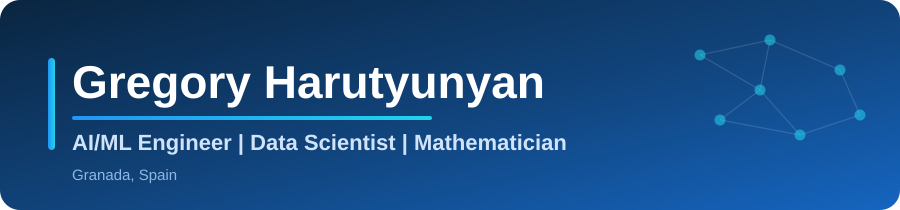

  

 

 

  

 

<picture>
  <source media="(prefers-color-scheme: dark)" srcset="assets/headers/sobre-mi-dark.svg">
  
</picture>

**AI / Machine Learning Engineer** with a background in **Mathematics** (UGR - #1 Mathematics degree in Spain, ShanghaiRanking 2025) and a **Master's in AI + Data Engineering specialization** (UNIR) in its final stage. EU citizen based in Granada, open to relocation and **available for internships or junior roles**.

During my internship at **Qualígrafo**, I worked on the LLM inference engine of Mimesis, an AI platform that helps psychologists and researchers turn hours of interviews into customised surveys, extracting relevant patterns and generating conclusions automatically.

I'm finishing an MSc in Artificial Intelligence with a specialization in Data Engineering (UNIR). My Master's thesis uses **machine learning and graph neural networks** to predict, before execution, how much noise will degrade a quantum circuit, so that poor executions can be avoided and quantum processor time and costs can be reduced.

I have worked hands-on across the main branches of AI: natural language processing (transformers, RAG/KAG), computer vision, deep learning (CNNs, GNNs), unsupervised learning and anomaly detection. The Data Engineering specialization adds the cloud-at-scale side: streaming pipelines with **Spark + Kafka** on **Dataproc**, analytics with **BigQuery** and MLOps tooling (Docker, MLflow, W&B, DVC).

I work particularly well in team environments and I pick up new stacks quickly. I am comfortable across the entire data lifecycle: from exploration and preprocessing to deploying inference services.

 

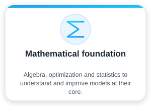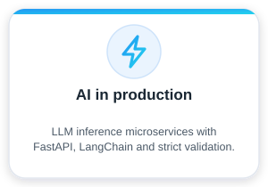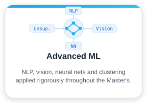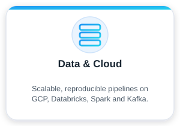

---

<picture>
  <source media="(prefers-color-scheme: dark)" srcset="assets/headers/experiencia-dark.svg">
  
</picture>

### Backend AI Engineer / LLMOps - Internship · Qualígrafo S.L. · Mimesis Platform
> Mar 2026 – May 2026 · 3 months · Granada (Remote)

> <code>Python</code> · <code>FastAPI</code> · <code>LangChain</code> · <code>Pydantic</code> · <code>Groq API</code> · <code>Azure OpenAI</code> · <code>Ollama</code> · <code>HPC (SCAYLE)</code>
>
> - **AI Assistant Backend (HPC):** Migrated the API of an AI assistant for psychologists and researchers (2 mixed-methods pipelines of 4 phases each, with 10 endpoints) to an asynchronous job-based system. Validated the architecture for the SCAYLE supercomputing cluster.
> - **Hallucination mitigation:** Implemented JSON Schemas and real-time validation with Pydantic for 8 prompt stages in an orchestrated LLM pipeline.
> - **Inference flexibility:** Developed an abstraction layer with LangChain to switch between 3 LLM providers (Ollama, Groq, Azure OpenAI) to optimize latency and cost depending on the environment.

 

---

<picture>
  <source media="(prefers-color-scheme: dark)" srcset="assets/headers/tfm-dark.svg">
  
</picture>

### Quantum Noise Mitigation with AI &nbsp; 
> Submitted · 2026 · Master's in AI · UNIR

> <code>Python</code> · <code>PyTorch Geometric</code> · <code>Qiskit Aer</code> · <code>Scikit-learn</code> · <code>W&amp;B</code> · <code>DVC</code> · <code>GCP</code>
>
> **Can we predict, before running a quantum circuit, how much noise will degrade its result?** Current error-mitigation techniques act after measurement and require running the circuit many times, which consumes an expensive and scarce resource: quantum processor time. This thesis studies whether that degradation can be anticipated from the circuit structure and the processor calibration alone.

<picture>
  <source media="(prefers-color-scheme: dark)" srcset="assets/cards/tfm-pipeline-dark.svg">
  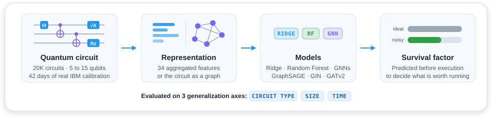
</picture>

> - **Dataset:** 20,000 circuits of 5 to 15 qubits, labeled with their exact degradation using 42 days of real calibration data from an IBM processor, and split along 3 independent generalization axes (circuit type, size and time).
> - **Target:** the signed degradation turned out not to be predictable before execution; reformulated as a *survival factor* (the fraction of signal that remains after noise), it is.
> - **Results:** Random Forest wins overall and is the only model that never worsens the corrected observable (up to 81% relative improvement). Graph neural networks only pay off when extrapolating to larger circuits (+0.21 and +0.23 R² over Random Forest on the X observable at 14 and 15 qubits).

 

---

<picture>
  <source media="(prefers-color-scheme: dark)" srcset="assets/headers/stack-dark.svg">
  
</picture>

**Languages &amp; Backend**

**Machine Learning · NLP · Vision**

**LLMs &amp; GenAI**

**Deep Learning**

**Quantum Computing**

**Cloud &amp; Data Engineering**

**Infrastructure &amp; MLOps**

**AI-Assisted Development**

 

---

<picture>
  <source media="(prefers-color-scheme: dark)" srcset="assets/headers/proyectos-dark.svg">
  
</picture>

<a href="https://github.com/greghgev/hate-speech-classification-mlops">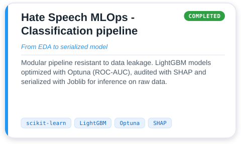</a><a href="https://github.com/greghgev/hate-speech-analysis-nlp">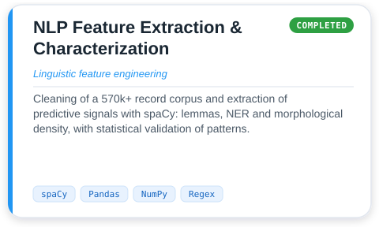</a>

<a href="https://github.com/greghgev/master-ia-unir/tree/main/tecnicas-aa/covertype-rf-svm-comparison">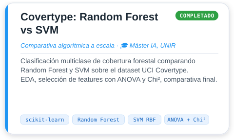</a><a href="https://github.com/greghgev/master-ia-unir/tree/main/pln/pln_rag_kag_comparison">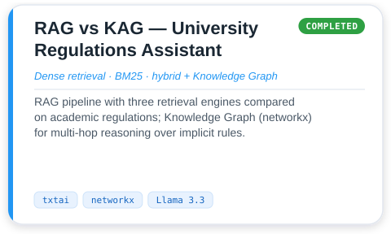</a>

<a href="https://github.com/greghgev/master-ia-unir/tree/main/vision-artificial/retinoblastoma-spatial-vs-morphology">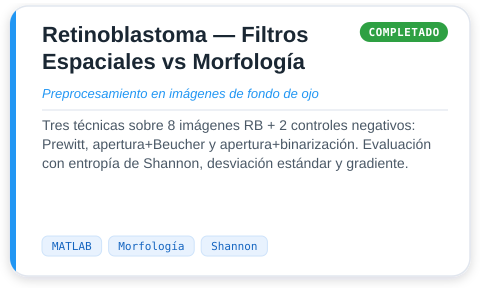</a><a href="#">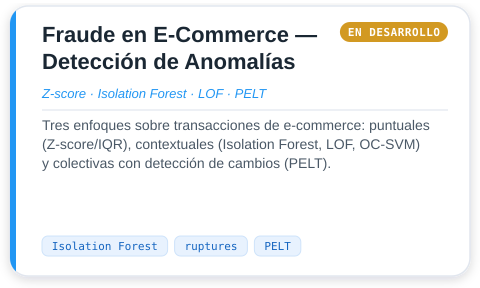</a>

 

---

<picture>
  <source media="(prefers-color-scheme: dark)" srcset="assets/headers/formacion-dark.svg">
  
</picture>

### Master's Degree in Artificial Intelligence + Data Engineering specialization - UNIR &nbsp;  
> 
<b>In progress · Nov 2025 – Jul 2026</b>

> 
> - **Master's Thesis:** application of AI techniques for noise mitigation in quantum computing.
> - **Data Engineering:** labs on continuous processing pipelines (Apache Kafka, Spark Streaming) and analytical ingestion in the cloud (GCP, BigQuery).

### Bachelor's Degree in Mathematics - University of Granada (UGR) &nbsp; 
> 
<b>2021 – 2025</b>

> 
> - Completed in the standard time (4 years) in the Mathematics degree ranked **#1 in Spain**.
> - **Bachelor's Thesis:** extensions of isometries between subsets of certain Banach spaces.

 

<b>Master's courses</b>

<!-- ===========================================================
  HOW TO EDIT THE ACTIVITIES:
  Inside each course's <ul>, add or remove lines in HTML
  (it sits inside a table cell, so it is NOT markdown):
        <li><a href="https://github.com/greghgev/REPO-NAME">Activity name</a></li>
============================================================ -->

<table>
  <tr>
    <td valign="top", width="35%">
      <b>Natural Language Processing</b>
      <ul>
        <li><a href="https://github.com/greghgev/master-ia-unir/tree/main/pln/newsgroups-embeddings-vs-transformers">Word Embeddings vs Transformers - Text classification (20 Newsgroups)</a></li>
        <li><a href="https://github.com/greghgev/master-ia-unir/tree/main/pln/pln_rag_kag_comparison">RAG vs KAG - University regulations assistant with a knowledge graph</a></li>
      </ul>
    </td>
    <td valign="top"></td>
    <td valign="top"><small>spaCy, Hugging Face, Freeling; morphosyntax, LLM fine-tuning and chatbots.</small></td>
  </tr>
  <tr>
    <td valign="top">
      <b>Machine Learning Techniques</b>
      <ul>
        <li><a href="https://github.com/greghgev/master-ia-unir/tree/main/tecnicas-aa/airquality-linear-regression-vs-decision-tree">Linear Regression vs Decision Tree - Benzene prediction (AirQualityUCI)</a></li>
        <li><a href="https://github.com/greghgev/master-ia-unir/tree/main/tecnicas-aa/covertype-rf-svm-comparison">SVM vs Random Forest - Multiclass forest cover classification (Covertype)</a></li>
      </ul>
    </td>
    <td valign="top"></td>
    <td valign="top"><small>Naive Bayes, decision trees, metrics (F1, recall, ROC) and hyperparameter optimization.</small></td>
  </tr>
  <tr>
    <td valign="top">
      <b>Computer Vision</b>
      <ul>
        <li><a href="https://github.com/greghgev/master-ia-unir/tree/main/vision-artificial/retinoblastoma-spatial-vs-morphology">Spatial filters vs mathematical morphology - Retinoblastoma detection</a></li>
        <li><a href="https://github.com/greghgev/master-ia-unir/tree/main/vision-artificial/amazon-deforestation-segmentation">HSV segmentation on Landsat images - Amazon deforestation (2000–2019)</a></li>
      </ul>
    </td>
    <td valign="top"></td>
    <td valign="top"><small>Time/frequency-domain processing, feature extraction, textures and multiscale analysis.</small></td>
  </tr>
  <tr>
    <td valign="top">
      <b>Automated Reasoning and Planning</b>
    </td>
    <td valign="top"></td>
    <td valign="top"><small>PDDL and search algorithms (informed and uninformed).</small></td>
  </tr>
  <tr>
    <td valign="top">
      <b>Unsupervised Machine Learning</b>
      <ul>
        <li><i>Coming soon</i></li>
      </ul>
    </td>
    <td valign="top"></td>
    <td valign="top"><small>K-Means, DBSCAN, t-SNE, MDS, ISOMAP, anomaly detection and reinforcement learning.</small></td>
  </tr>
  <tr>
    <td valign="top">
      <b>Neural Networks</b>
      <ul>
        <li><i>Coming soon</i></li>
      </ul>
    </td>
    <td valign="top"></td>
    <td valign="top"><small>Keras, TensorFlow, GANs, CUDA/cuDNN; images, time series and cloud AI.</small></td>
  </tr>
</table>

 

<b>Advanced Program in Data Engineering courses</b>

<!-- ===========================================================
  HOW TO EDIT THE ACTIVITIES:
  Inside each course's <ul>, add or remove lines in HTML
  (it sits inside a table cell, so it is NOT markdown):
        <li><a href="https://github.com/greghgev/REPO-NAME">Activity name</a></li>
============================================================ -->

<table>
  <tr>
    <td valign="top", width="40%">
      <b>Engineering for Massive Data Processing</b>
      <ul>
        <li><a href="https://github.com/greghgev/master-ia-unir/tree/main/ingenieria-datos/walmart-sales-bigquery-eda">Walmart Sales EDA - Exploratory analysis with Google BigQuery and SQL</a></li>
        <li><a href="https://github.com/greghgev/master-ia-unir/tree/main/ingenieria-datos/flights-spark-streaming-kafka">Flights - Spark Structured Streaming + Kafka on Google Dataproc</a></li>
      </ul>
    </td>
    <td valign="top"></td>
    <td valign="top"><small>Large-scale ETL with Spark, relational warehouses on Hive and cloud services (GCP, Azure, AWS).</small></td>
  </tr>
  <tr>
    <td valign="top">
      <b>MLOps and AIOps: Deploying Models in Production Environments</b>
      <ul>
        <li><i>Coming soon</i></li>
      </ul>
    </td>
    <td valign="top"></td>
    <td valign="top"><small>CI/CD for ML with MLflow, Docker, Google Vertex AI and orchestration in production.</small></td>
  </tr>
</table>

 

---

**Languages**

 

<!-- ===========================================================
  "GITHUB ACTIVITY" SECTION - HIDDEN.
  (If you re-enable it, you will again need the workflows from the .github
  folder that were deleted, because they generate metrics.svg and the output branch.)
  To show it, delete THIS opening comment line and the closing one.
============================================================

<picture>
  <source media="(prefers-color-scheme: dark)" srcset="assets/headers/actividad-dark.svg">
  
</picture>

  

<picture>
  <source media="(prefers-color-scheme: dark)" srcset="https://raw.githubusercontent.com/greghgev/greghgev/output/snake-dark.svg">
  
</picture>

 

============================ END OF HIDDEN SECTION ============================ -->

---

<picture>
  <source media="(prefers-color-scheme: dark)" srcset="assets/headers/cv-dark.svg">
  
</picture>

<a href="assets/cv.pdf">
  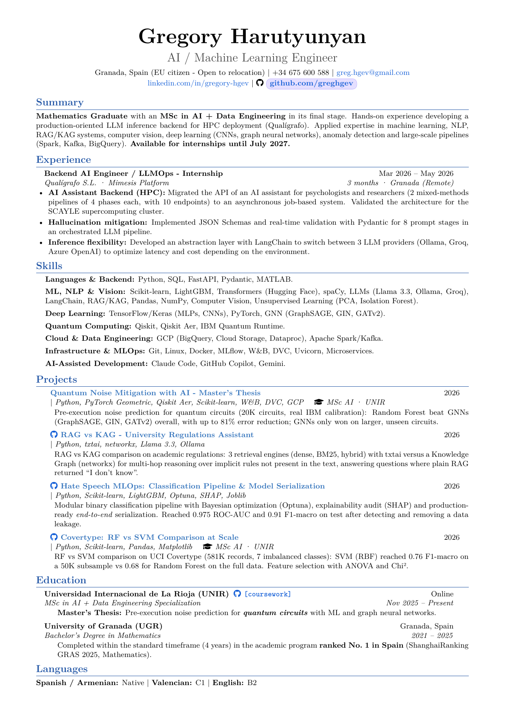
</a>

 

Click the image to open the full PDF.

 

---

### Available for hire

Open to **AI/ML Engineer** (Junior) positions and internships in Machine Learning, LLMs and Data Engineering teams.

