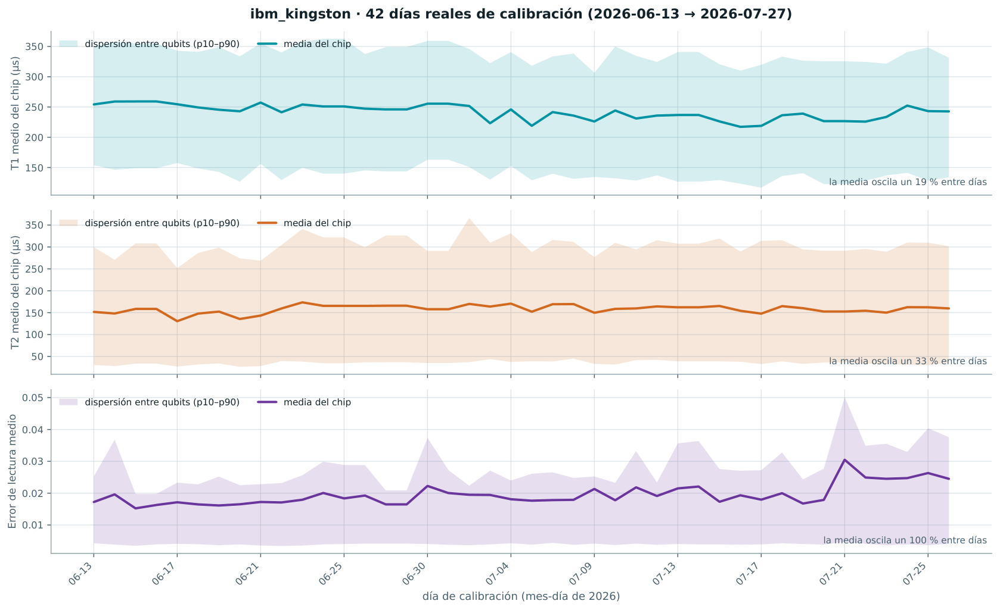
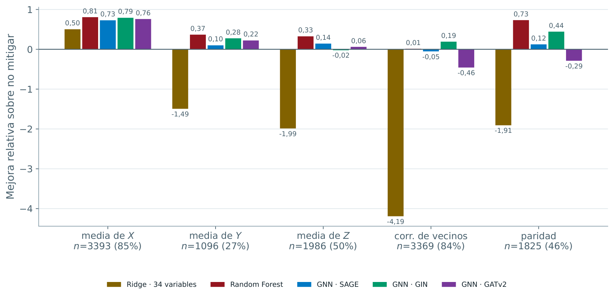
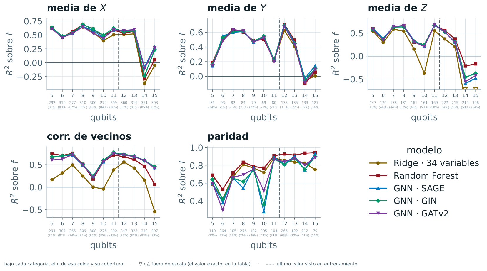
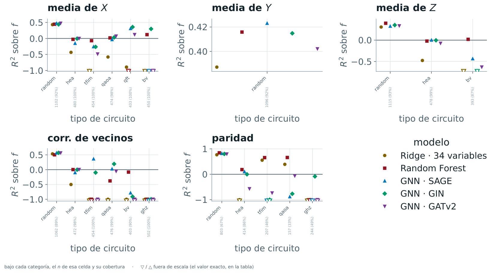
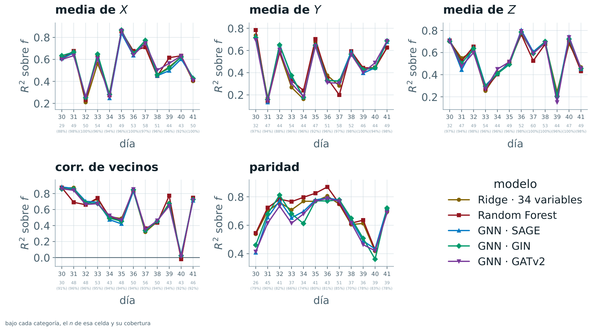

# Quantum Noise Mitigation with AI

> Master's Thesis · Submitted · 2026 · Master's in AI · UNIR

📄 **[Master's Thesis (PDF, in Spanish)](master-thesis.pdf)**

> [!NOTE]
> **Code repository coming soon.** The full code (dataset generation, models and experiments) is being prepared for public release.

<code>Python</code> · <code>PyTorch Geometric</code> · <code>Qiskit Aer</code> · <code>Scikit-learn</code> · <code>W&amp;B</code> · <code>DVC</code> · <code>GCP</code>

**Can we predict, before running a quantum circuit, how much noise will degrade its result?** Current error-mitigation techniques act after measurement and require running the circuit many times, which consumes an expensive and scarce resource: quantum processor time. This thesis studies whether that degradation can be anticipated from the circuit structure and the processor calibration alone.

## A novel, little-explored approach

Existing methods, including those based on machine learning, correct the result **after** the circuit has been run. The few that act **before** execution only decide whether a circuit is worth running or where to run it, not how much its result will degrade. Predicting that degradation without spending quantum processor time still has very few contributions in the literature, and **none of the reviewed works combines the four features of this proposal**:

| Work | Pre-execution | Magnitude | Multi-output | Calibration drift |
|---|:---:|:---:|:---:|:---:|
| ZNE, PEC, M3 | ❌ | ✅ | ❌ | ❌ |
| Liao et al. (2024) | ❌ | ✅ | ❌ | 🟡 partial |
| GTraQEM, QEMFormer | ❌ | ✅ | ✅ | ❌ |
| mapomatic, Hartnett et al. (2024) | ✅ | ❌ | ❌ | ❌ |
| QuEst — Wang et al. (2025) | ✅ | ✅ | ❌ | ❌ |
| Liu et al. (2026) | ✅ | ✅ | ❌ | ❌ |
| Aktar et al. (2024) | ✅ | ✅ | ❌ | ❌ |
| Martyniuk et al. (2025) | ✅ | ✅ | ❌ | ❌ |
| Tudisco et al. (2025) | ✅ | ❌ | ❌ | ❌ |
| **This thesis** | ✅ | ✅ | ✅ | ✅ |

*Pre-execution:* the model never sees the measured result. *Magnitude:* it predicts how much the result degrades, not just whether to run the circuit. *Multi-output:* five observables at once instead of a single value. *Calibration drift:* real, disjoint calibration days between training and test.

## A dataset built from scratch

No dataset existed to answer this question, so **I designed and generated my own**:

- **20,000 circuits** of 5 to 15 qubits, simulated on a digital twin of the IBM `ibm_kingston` processor and labeled with their **exact** degradation.
- The noise is not invented: it is reconstructed **day by day from 42 days of real calibration data** from the processor.
- The split forces generalization along **3 independent axes**: circuit type, circuit size and calibration day.

  

Real daily recalibration of <code>ibm_kingston</code> over the 42 days used to build the dataset (T1, T2 and readout error). Labels in Spanish.

## Results

- **Target:** the signed degradation turned out not to be predictable before execution; reformulated as a *survival factor* (the fraction of signal that remains after noise), it is.
- **Random Forest wins overall** and is the only model that never worsens the corrected observable (up to 81% relative improvement).
- **Graph neural networks only pay off when extrapolating to larger circuits** (+0.21 and +0.23 R² over Random Forest on the X observable at 14 and 15 qubits).

  

Relative improvement over no mitigation, by observable and model (Ridge, Random Forest and GNNs with SAGE, GIN and GATv2 convolutions). Labels in Spanish: <i>media de X/Y/Z</i> = mean of X/Y/Z, <i>corr. de vecinos</i> = nearest-neighbor ZZ correlator, <i>paridad</i> = parity.

### Generalization along the three axes

The test set forces each model to generalize along three independent axes. Every plot shows the R² on the survival factor *f*, per observable and model (same Spanish labels as above).

#### **Size**: extrapolating to larger circuits

Training goes up to 11 qubits and the test set up to 15 (dashed line), so the last four points are pure extrapolation. Within the known range all models move together. Beyond it, the **graph neural network beats Random Forest on the mean of X** (+0.21 and +0.23 R² at 14 and 15 qubits), the mean of Z collapses for every model, and **parity holds** (0.89–0.95 up to 15 qubits), led by Random Forest.

  

#### **Type**: algorithms never seen in training

Training uses only random circuits, so the six structured circuit types (HEA, TFIM, QAOA, QFT, BV and GHZ) are evaluated blind. R² drops in most cases. On random circuits every model works (0.31–0.57); graph neural networks beat Random Forest only in a few cells, such as QFT and BV on the mean of X, and Random Forest wins most of the rest.

  

#### **Time**: unseen calibration days

Measured only on random circuits of up to 11 qubits, so the only thing that changes is the calibration day: 12 real days (30 to 41) never seen in training. **No measurable drift**: the five models rise and fall together from one day to the next.

  

---

[← Back to profile](https://github.com/greghgev)
